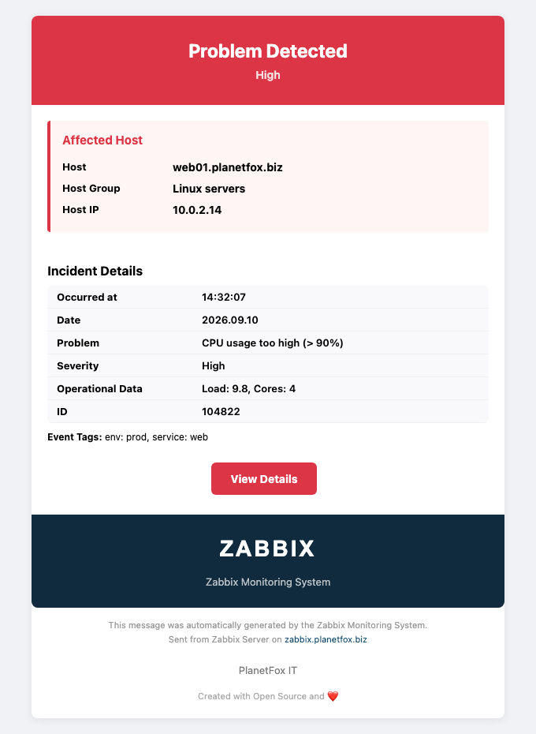
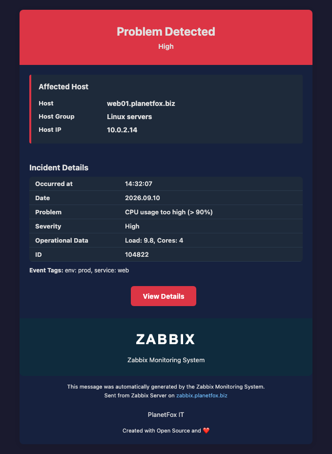

# Zabbix HTML E-Mail Templates V1.1

Modern, responsive HTML email templates for **Zabbix 7.4** with Dark Mode support, Outlook compatibility and mobile-friendly design. Available in 5 languages.


---

## Preview

<p align="center">
  
  &nbsp;
  
</p>

All 10 templates in all 5 languages, in light and dark mode, rendered with sample data:

| Template | DE | EN | FR | ES | PT |
|----------|----|----|----|----|----|
| Problem | [light](screenshots/de/problem.png) · [dark](screenshots/de/problem-dark.png) | [light](screenshots/en/problem.png) · [dark](screenshots/en/problem-dark.png) | [light](screenshots/fr/problem.png) · [dark](screenshots/fr/problem-dark.png) | [light](screenshots/es/problem.png) · [dark](screenshots/es/problem-dark.png) | [light](screenshots/pt/problem.png) · [dark](screenshots/pt/problem-dark.png) |
| Recovery | [light](screenshots/de/recovery.png) · [dark](screenshots/de/recovery-dark.png) | [light](screenshots/en/recovery.png) · [dark](screenshots/en/recovery-dark.png) | [light](screenshots/fr/recovery.png) · [dark](screenshots/fr/recovery-dark.png) | [light](screenshots/es/recovery.png) · [dark](screenshots/es/recovery-dark.png) | [light](screenshots/pt/recovery.png) · [dark](screenshots/pt/recovery-dark.png) |
| Update | [light](screenshots/de/update.png) · [dark](screenshots/de/update-dark.png) | [light](screenshots/en/update.png) · [dark](screenshots/en/update-dark.png) | [light](screenshots/fr/update.png) · [dark](screenshots/fr/update-dark.png) | [light](screenshots/es/update.png) · [dark](screenshots/es/update-dark.png) | [light](screenshots/pt/update.png) · [dark](screenshots/pt/update-dark.png) |
| Discovery | [light](screenshots/de/discovery.png) · [dark](screenshots/de/discovery-dark.png) | [light](screenshots/en/discovery.png) · [dark](screenshots/en/discovery-dark.png) | [light](screenshots/fr/discovery.png) · [dark](screenshots/fr/discovery-dark.png) | [light](screenshots/es/discovery.png) · [dark](screenshots/es/discovery-dark.png) | [light](screenshots/pt/discovery.png) · [dark](screenshots/pt/discovery-dark.png) |
| Autoregistration | [light](screenshots/de/autoregistration.png) · [dark](screenshots/de/autoregistration-dark.png) | [light](screenshots/en/autoregistration.png) · [dark](screenshots/en/autoregistration-dark.png) | [light](screenshots/fr/autoregistration.png) · [dark](screenshots/fr/autoregistration-dark.png) | [light](screenshots/es/autoregistration.png) · [dark](screenshots/es/autoregistration-dark.png) | [light](screenshots/pt/autoregistration.png) · [dark](screenshots/pt/autoregistration-dark.png) |
| Internal Problem | [light](screenshots/de/internal-problem.png) · [dark](screenshots/de/internal-problem-dark.png) | [light](screenshots/en/internal-problem.png) · [dark](screenshots/en/internal-problem-dark.png) | [light](screenshots/fr/internal-problem.png) · [dark](screenshots/fr/internal-problem-dark.png) | [light](screenshots/es/internal-problem.png) · [dark](screenshots/es/internal-problem-dark.png) | [light](screenshots/pt/internal-problem.png) · [dark](screenshots/pt/internal-problem-dark.png) |
| Internal Recovery | [light](screenshots/de/internal-recovery.png) · [dark](screenshots/de/internal-recovery-dark.png) | [light](screenshots/en/internal-recovery.png) · [dark](screenshots/en/internal-recovery-dark.png) | [light](screenshots/fr/internal-recovery.png) · [dark](screenshots/fr/internal-recovery-dark.png) | [light](screenshots/es/internal-recovery.png) · [dark](screenshots/es/internal-recovery-dark.png) | [light](screenshots/pt/internal-recovery.png) · [dark](screenshots/pt/internal-recovery-dark.png) |
| Service Problem | [light](screenshots/de/service-problem.png) · [dark](screenshots/de/service-problem-dark.png) | [light](screenshots/en/service-problem.png) · [dark](screenshots/en/service-problem-dark.png) | [light](screenshots/fr/service-problem.png) · [dark](screenshots/fr/service-problem-dark.png) | [light](screenshots/es/service-problem.png) · [dark](screenshots/es/service-problem-dark.png) | [light](screenshots/pt/service-problem.png) · [dark](screenshots/pt/service-problem-dark.png) |
| Service Recovery | [light](screenshots/de/service-recovery.png) · [dark](screenshots/de/service-recovery-dark.png) | [light](screenshots/en/service-recovery.png) · [dark](screenshots/en/service-recovery-dark.png) | [light](screenshots/fr/service-recovery.png) · [dark](screenshots/fr/service-recovery-dark.png) | [light](screenshots/es/service-recovery.png) · [dark](screenshots/es/service-recovery-dark.png) | [light](screenshots/pt/service-recovery.png) · [dark](screenshots/pt/service-recovery-dark.png) |
| Service Update | [light](screenshots/de/service-update.png) · [dark](screenshots/de/service-update-dark.png) | [light](screenshots/en/service-update.png) · [dark](screenshots/en/service-update-dark.png) | [light](screenshots/fr/service-update.png) · [dark](screenshots/fr/service-update-dark.png) | [light](screenshots/es/service-update.png) · [dark](screenshots/es/service-update-dark.png) | [light](screenshots/pt/service-update.png) · [dark](screenshots/pt/service-update-dark.png) |

> The logo in the footer is a placeholder for these previews; live emails use your `{$ZABBIXHOST_LOGO}` macro. Regenerate the screenshots with `python3 tools/render_previews.py` (needs PyYAML and Chrome or Chromium).

---

## Features

| Feature | V1.0 (Original) | V1.1 |
|---------|:---:|:---:|
| Outlook compatible (table layout) | ❌ | ✅ |
| Rounded buttons in Outlook (VML) | ❌ | ✅ |
| Inline CSS | ❌ | ✅ |
| Dark Mode | ❌ | ✅ |
| System Fonts | ❌ | ✅ |
| MSO Conditionals | ❌ | ✅ |
| Host IP `{HOST.IP}` | ❌ | ✅ |
| Event Tags | ❌ | ✅ |
| Operational Data | ❌ | ✅ |
| Duration in Recovery | ❌ | ✅ |
| Update User/Message | ❌ | ✅ |
| Mobile responsive (620px) | ❌ | ✅ |
| Languages | DE | DE / EN / FR / ES / PT |

## Languages

| File | Language |
|------|----------|
| `zbx_html-modern-message_V1.1_DE.yaml` | Deutsch |
| `zbx_html-modern-message_V1.1_EN.yaml` | English |
| `zbx_html-modern-message_V1.1_FR.yaml` | Français |
| `zbx_html-modern-message_V1.1_ES.yaml` | Español |
| `zbx_html-modern-message_V1.1_PT.yaml` | Português |

Each file contains **10 message templates**: Trigger (Problem/Recovery/Update), Discovery, Autoregistration, Internal (Problem/Recovery), Service (Problem/Recovery/Update).

## Color Scheme

| Event Type | Color | Hex |
|------------|-------|-----|
| Problem | 🔴 Red | `#dc3545` |
| Recovery | 🟢 Green | `#28a745` |
| Update | 🔵 Cyan | `#17a2b8` |
| Discovery | 🔵 Blue | `#0275d8` |
| Internal | 🟡 Yellow | `#e6a800` |
| Service | 🟠 Orange | `#f0ad4e` |

---

## Installation

### 1. Download Logo

Download the official Zabbix logo (or use your own):

**→ [Zabbix Logo Download](https://www.zabbix.com/de/trademark#colors)**

### 2. Place Logo on Server

```bash
sudo cp zabbix_logo.png /usr/share/zabbix/ui/assets/img/
sudo chmod 644 /usr/share/zabbix/ui/assets/img/zabbix_logo.png
```

Verify: open `https://your-zabbix-host/assets/img/zabbix_logo.png` in a browser.

> **Note:** If your Zabbix root is `/usr/share/zabbix/` (not `/usr/share/zabbix/ui/`), adjust the path accordingly.

### 3. Import Template

**New installation:**
1. Go to **Alerts → Media types → Import** (top right)
2. Select the YAML file for your language
3. Enable **"Create new"**
4. Click **Import**
5. Configure SMTP settings (see step 4)

**Update from V1.0:**
1. Go to **Alerts → Media types → Import** (top right)
2. Select the V1.1 YAML file
3. Enable **"Update existing"**
4. Click **Import**
5. **Re-enter your SMTP settings** — the import resets the complete SMTP configuration to placeholders: server, helo and email become `localhost`, authentication is switched off and **username and password are removed**. Until you re-enter them, no notifications are sent through this media type — note your settings and have the SMTP password at hand before importing.

### 4. Configure SMTP

Open the imported media type and enter your SMTP settings:

| Field | Example |
|-------|---------|
| SMTP server | `mail.example.de` |
| SMTP server port | `587` |
| SMTP helo | `zabbix.example.de` |
| SMTP email | `zabbix@example.de` |
| Connection security | STARTTLS |
| Authentication | Username and password |

### 5. Set Global Macros

Go to **Administration → Macros** and create:

| Macro | Value | Purpose |
|-------|-------|---------|
| `{$ZABBIXHOST}` | `zabbix.example.de` | Hostname in footer |
| `{$ZABBIXHOST_LINK}` | `https://zabbix.example.de` | Base URL for links |
| `{$ZABBIXHOST_LOGO}` | `https://zabbix.example.de/assets/img/zabbix_logo.png` | Logo URL |
| `{$CUSTOM_MESSAGE_COMPANY}` | `ACME Corp — IT Dept` | Company name in footer |
| `{$ZABBIXHOST_LOVE}` | `Created with Open Source and ❤️` | Optional footer text |

### 6. Assign to Users

1. Go to **Users → Users** → select user
2. **Media** tab → **Add**
3. Type: `Email (HTML) modern V1.1 (DE/EN/FR/ES/PT)`
4. Send to: user's email address
5. **Add** → **Update**

### 7. Test

Click **Test** in the media type row under **Alerts → Media types**.

The test dialog sends exactly the subject and message you type in — not the message templates. To preview a template with your real SMTP settings without changing the media type:

1. Copy the `message` of a template from the YAML file (e.g. *Problem*)
2. Paste it into the **Message** field of the test dialog and click **Test**

Macros such as `{HOST.NAME}` or `{$ZABBIXHOST_LOGO}` stay unresolved in a test mail, so the logo is missing — that is expected.

---

## Troubleshooting

| Problem | Solution |
|---------|----------|
| Import error `unexpected tag content_type` | You have an old version. Use V1.1 which uses `message_format`. |
| Logo not showing | The logo must be placed inside your **Nginx/Apache document root** (check `root` directive in your webserver config). For Zabbix 7.4 with Nginx this is typically `/usr/share/zabbix/ui/`, so place the logo in `/usr/share/zabbix/ui/assets/img/`. Paths outside the document root (e.g. `/usr/share/zabbix/local/`) return 404. Also check: URL accessible in browser? `{$ZABBIXHOST_LOGO}` macro correct? File permissions `644`? Email clients may block external images by default. |
| Macros show as `{HOST.NAME}` | Global macros (`{$...}`): check Administration → Macros. Zabbix macros: only replaced in real events, not in media type test. |
| Text unreadable in Dark Mode | Update to V1.1 (CSS fix for `td`/`th`/`span` selectors). |
| Bright lines between the detail rows or a light frame around the card in Dark Mode | Fixed after the V1.1 release — re-import the current YAML file for your language (have your SMTP settings at hand, see *Update from V1.0*). |
| Emails in spam | Not a template issue. Configure SPF, DKIM and DMARC for your domain. |

## Uninstall

**Alerts → Media types** → check the box → **Delete**.

The YAML can be re-imported at any time. Make sure no active actions reference the media type before deletion.

---

## Credits

- **Original:** Alexander Fox (V0.2) — fox@linuser.de
- **V1.1 Rewrite:** Feb 2026 — Complete rewrite with modern email standards
- **Thanks:** Christian Anton ([@fibbs](https://github.com/fibbs), inqbeo) for the detailed review and the V1.2 proposal in [#1](https://github.com/linuser/Zabbix-modern-html-template/pull/1) — Zabbix severity colours, a compact layout, a modular build with end-to-end tests — and for finding the macro bugs in the service and internal templates.

## License

[CC BY-SA 4.0](https://creativecommons.org/licenses/by-sa/4.0/)
