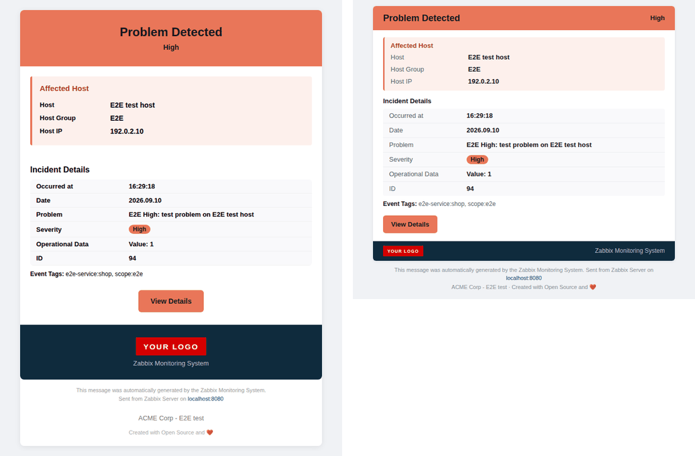
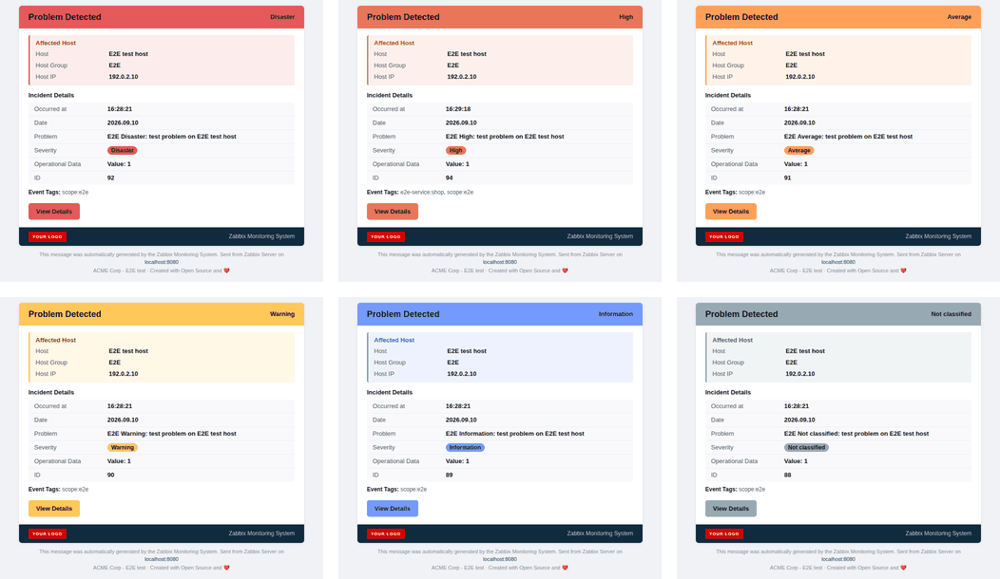
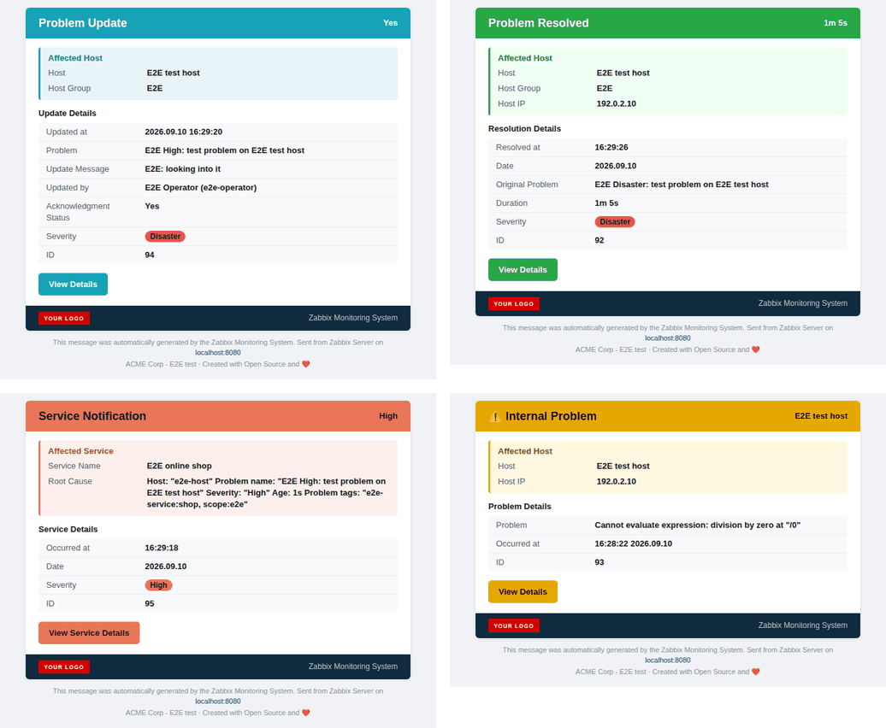
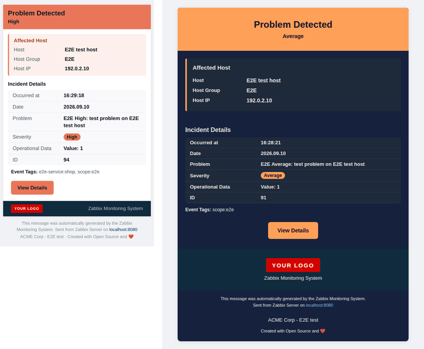
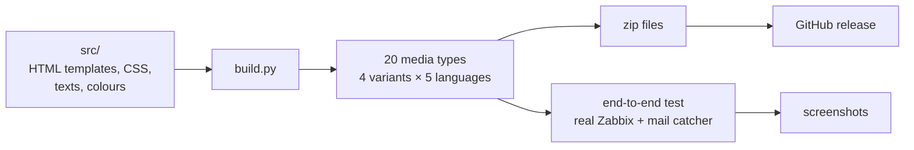

# Zabbix HTML E-Mail Templates

Modern, responsive HTML e-mail notifications for **Zabbix 7.0 and newer**: coloured by Zabbix severity, a **compact** layout for less scrolling, dark mode, Outlook support, mobile layout, five languages.




*Real mails from a Zabbix server - standard layout (left) and the new compact layout (right).*

---

## What's new in V1.2

- **Compact layout** - the same two boxes (host, details) in about a third less height: slim header, tight rows, slim footer. The standard layout stays available; both are separate media types, so you choose per user.
- **Zabbix severity colours** - problems are coloured Disaster red, High orange-red, Average orange, Warning yellow, Information blue or Not classified grey, exactly like in the Zabbix frontend. No JavaScript: Zabbix computes the colour itself when it sends the mail ([how](#colours)).
- **Logo optional** - every layout also comes without the logo image, for environments where mail clients cannot reach a web server.
- **Rounded buttons in classic Outlook** and several other Outlook fixes ([why corners are square there](#outlook)).
- **Zabbix 7.0, 7.4 and 8.0** - one set of files for all of them.
- **Tested end-to-end** against real Zabbix 7.0.30, 7.4.14 and 8.0.0rc1 servers: every layout and language, 18 notification types each. The test found and fixed long-standing bugs in the service and internal mails.
- **Ready-made downloads** - GitHub builds all media types and publishes them as zip files with every release.
- **Easy to change** - HTML templates, CSS, texts and colours are separate files; one build generates everything ([below](#built-tested-and-released-automatically)).

| | V1.1 | V1.2 |
|---|:---:|:---:|
| Colours by severity (6 levels) | ❌ | ✅ |
| Compact layout | ❌ | ✅ |
| Variant without logo image | ❌ | ✅ |
| Rounded buttons in classic Outlook | ❌ | ✅ |
| Zabbix versions | 7.4 | 7.0, 7.4, 8.0 |
| Service / internal mails without unresolved macros | ❌ | ✅ |
| Dark mode, mobile, 5 languages | ✅ | ✅ |
| Download as release zips | ❌ | ✅ |
| Automated end-to-end test with screenshots | ❌ | ✅ |

## Screenshots

**Every severity** (compact layout):



**Other notification types** - update, recovery, service problem, internal problem:



**Mobile and dark mode** - compact on a phone, standard in a dark mail client:



All screenshots are generated from real notifications of a Zabbix server by the end-to-end test (`test/e2e/e2e.sh docs`), not drawn by hand.

## Download

Pre-built media types are attached to every **[release](../../releases)**. Pick the zip that fits:

| Zip | Contains |
|---|---|
| `zabbix-html-mail-<version>-standard.zip` | standard layout, all languages |
| `zabbix-html-mail-<version>-compact.zip` | compact layout, all languages |
| `zabbix-html-mail-<version>-standard-nologo.zip` | standard layout without logo image, all languages |
| `zabbix-html-mail-<version>-compact-nologo.zip` | compact layout without logo image, all languages |
| `zabbix-html-mail-<version>-en.zip` (`de`, `fr`, `es`, `pt`) | all four variants in one language |
| `zabbix-html-mail-<version>-all.zip` | everything |
| `zabbix-html-mail-<version>-previews.zip` | HTML previews with sample data, to look at before importing |

Each YAML file is one media type, e.g. `zbx_html-modern-message_V1.2_compact_DE.yaml` → **Email (HTML) modern V1.2 compact (DE)**. It contains all 10 message templates: trigger problem / recovery / update, discovery, autoregistration, internal problem / recovery, service problem / recovery / update.

## Variants

| Variant | Look | Logo |
|---|---|---|
| **standard** | the classic look: large coloured header, host box, details table, dark footer | `{$ZABBIXHOST_LOGO}` |
| **compact** | about a third less height: slim header, the same two boxes with tight rows, slim footer | `{$ZABBIXHOST_LOGO}`, small |
| **standard-nologo** | standard | none - nothing is loaded from a web server |
| **compact-nologo** | compact | none |

Every variant is a separate media type, so you can import several and switch per user (**Users → Users → Media**) or per action operation. Use a *nologo* variant when recipients cannot reach the web server that hosts the logo, or when their mail client blocks external images anyway.

## Colours

Trigger problems are coloured by their severity, using the Zabbix default colours:

| Severity | Colour |
|---|---|
| Disaster | `#E45959` |
| High | `#E97659` |
| Average | `#FFA059` |
| Warning | `#FFC859` |
| Information | `#7499FF` |
| Not classified | `#97AAB3` |

Other messages keep their event-type colour and show the severity as a coloured badge:

| Message | Colour |
|---|---|
| Recovery, autoregistration | green `#28a745` |
| Update | cyan `#17a2b8` |
| Discovery | blue `#0275d8` |
| Internal problem | yellow `#e6a800` |
| Service problem | severity colour (fallback orange `#f0ad4e`) |

**How this works without JavaScript:** CSS cannot look at text like "High", but Zabbix expands macros *everywhere* in the message - including inside `style` attributes - before the mail is sent. Since Zabbix 7.0 macros can be transformed with macro functions, so the templates contain

```
background-color:{{EVENT.NSEVERITY}.regrepl(^5$,#E45959,^4$,#E97659,^3$,#FFA059,^2$,#FFC859,^1$,#7499FF,^0$,#97AAB3)}
```

which arrives in the mailbox as a plain `background-color:#E97659`. Every such declaration is preceded by a static fallback colour, so where the macro is not resolved - most notably the **Test** button of the media type - the mail still looks right, just in the fallback colour.

If you changed the severity colours under *Administration → General → Trigger displaying options*, adjust `src/themes.yaml` and [build your own files](#do-it-yourself).

## Installation

### 1. Logo (skip for *nologo* variants)

Download the [Zabbix logo](https://www.zabbix.com/de/trademark#colors) (or use your own) and put it into the document root of the Zabbix frontend:

```bash
sudo cp zabbix_logo.png /usr/share/zabbix/ui/assets/img/
sudo chmod 644 /usr/share/zabbix/ui/assets/img/zabbix_logo.png
```

Check that `https://your-zabbix-host/assets/img/zabbix_logo.png` opens in a browser. (Zabbix 7.0 packages use `/usr/share/zabbix/` without `ui/`; adjust the path.) The logo is fetched by the **recipient's mail client**, not by Zabbix - it has to be reachable from wherever your users read mail.

### 2. Import

**Alerts → Media types → Import**, select the YAML file, enable **Create new**, **Import**.

### 3. SMTP

Open the imported media type and enter your SMTP settings (the import contains placeholders):

| Field | Example |
|---|---|
| SMTP server | `mail.example.com` |
| SMTP server port | `587` |
| SMTP helo | `zabbix.example.com` |
| SMTP email | `zabbix@example.com` |
| Connection security | STARTTLS |
| Authentication | Username and password |

### 4. Global macros

**Administration → Macros**:

| Macro | Example | Used for |
|---|---|---|
| `{$ZABBIXHOST}` | `zabbix.example.com` | host name in the footer |
| `{$ZABBIXHOST_LINK}` | `https://zabbix.example.com` | base URL of the buttons |
| `{$ZABBIXHOST_LOGO}` | `https://zabbix.example.com/assets/img/zabbix_logo.png` | logo (not needed for *nologo*) |
| `{$CUSTOM_MESSAGE_COMPANY}` | `ACME Corp - IT Operations` | company line in the footer |
| `{$ZABBIXHOST_LOVE}` | `Created with Open Source and ❤️` | optional footer text |

### 5. Assign to users

**Users → Users** → user → **Media** → **Add**, type *Email (HTML) modern V1.2 … (…)*, send to the user's address.

### 6. Test

The **Test** button in **Alerts → Media types** sends a mail with *unresolved* macros: you see `{HOST.NAME}` instead of a host name, and severity-coloured parts in their fallback colour. Real notifications are fully resolved.

## Upgrading from V1.1

V1.2 media types have new names (the variant is part of the name), so importing creates new media types instead of overwriting V1.1:

1. Import the V1.2 variant(s) you want and configure SMTP (step 3).
2. Switch the users' media from *Email (HTML) modern V1.1 (…)* to the new media type.
3. Delete the V1.1 media type once no user or action uses it.

The global macros stay the same.

## Outlook

**Why rounded corners are square in Outlook:** classic Outlook for Windows (2007 - 2021 and the "classic" Microsoft 365 app) does not render mail with a browser engine but with **Microsoft Word**, which ignores `border-radius` (and `box-shadow`, `max-width`, `rgba()` colours, …). No CSS can change that.

What the templates do about it:

- **Buttons** are drawn a second time as a VML `<v:roundrect>` inside `<!--[if mso]>` comments - the standard "bulletproof button" technique - so they are rounded in classic Outlook as well.
- **Cards and headers** stay square in classic Outlook. Rounding them with VML means wrapping the whole mail in a VML text box, which breaks easily with Windows display scaling and long content, and the coloured header cell would still cover the rounded corners. It is not worth the risk for a notification mail.
- The `<html>` element declares the VML/Office namespaces (the `OfficeDocumentSettings` block needs them), Outlook gets Segoe UI instead of falling back to Times New Roman, and the logo has a `width` attribute - classic Outlook ignores CSS `max-width` and would otherwise show a large logo in full size.

New Outlook for Windows, Outlook for Mac, Outlook on the web and the Outlook mobile apps use a browser engine and show everything rounded.

## Built, tested and released automatically

Nothing in this repository is edited by hand in 20 copies. The media types are generated from one set of sources, tested against real Zabbix servers and published by GitHub Actions:



| Where | What happens |
|---|---|
| every push and pull request | GitHub Actions builds all media types, checks them and offers the zips as a workflow artifact |
| pull requests touching the sources | the end-to-end test runs against Zabbix 7.0, 7.4 and the upcoming major version; every received mail and its screenshots are attached to the run |
| pushing a tag `v1.2.0` | GitHub Actions builds everything and **creates a release** with all zip files as assets |

### Do it yourself

Everything the automation does also runs on your machine:

| Command | Result | Needs |
|---|---|---|
| `python build.py` | all media types in `dist/yaml/`, release zips in `dist/` | Python ([setup](docs/DEVELOPMENT.md#building)) |
| `python build.py --preview` | `dist/previews/index.html`: every variant with sample data | Python |
| `test/e2e/e2e.sh run` | a real Zabbix sends all 360 test mails to Mailpit (http://localhost:8025), each checked for completeness - `test/e2e/e2e.sh open` shows them; add `E2E_SCREENSHOTS=desktop,mobile,dark` for a screenshot gallery | Docker |
| `test/e2e/e2e.sh docs` | regenerates the screenshots of this README in `docs/img/` | Docker |
| `git tag v1.2.0 && git push origin v1.2.0` | GitHub release with all zips | push access |

Details:

- [docs/DEVELOPMENT.md](docs/DEVELOPMENT.md) - repository layout, how a message is built, changing texts / colours / layouts, adding languages or flavours, releasing.
- [docs/TESTING.md](docs/TESTING.md) - the Docker end-to-end test, its options, and the README screenshots.
- [CHANGELOG.md](CHANGELOG.md)

## Troubleshooting

| Problem | Solution |
|---|---|
| Import error `unexpected tag content_type` | You are importing a pre-V1.1 file. Use a current release. |
| Mail from the **Test** button shows `{HOST.NAME}` and a red/orange header regardless of severity | Expected - the test does not resolve macros. Trigger a real problem. |
| Logo not showing | The logo must be inside the web server's document root (`root` directive of your Nginx/Apache site; Zabbix 7.4 packages: `/usr/share/zabbix/ui/`, 7.0: `/usr/share/zabbix/`). Paths outside it return 404. Check the URL in a browser, the `{$ZABBIXHOST_LOGO}` macro and file permissions (`644`). Many mail clients block external images until you allow them - or use a *nologo* variant. |
| Macros show as `{$ZABBIXHOST}` in real mails | The global macro is not defined (Administration → Macros). |
| All problems have the same colour | Your Zabbix is older than 7.0 (no macro functions), or you are looking at a Test mail. |
| Text unreadable in dark mode | Some clients (Gmail, Outlook.com) apply their own dark mode and ignore the template's. |
| Mails land in spam | Not a template issue: configure SPF, DKIM and DMARC for the sender domain. |

## Older versions

V1.0 and V1.1 (pre-built YAML files, old screenshots) are in the git history: [repository as of V1.1](../../tree/2a42576).

## Credits

- **Original:** Alexander Fox (V0.2) - fox@linuser.de
- **V1.1:** Feb 2026 - complete rewrite with modern e-mail standards
- **V1.2:** Sep 2026 - Christian Anton - modular build, severity colours, compact and no-logo variants, Outlook VML buttons, end-to-end tests

## License

[CC BY-SA 4.0](https://creativecommons.org/licenses/by-sa/4.0/)
