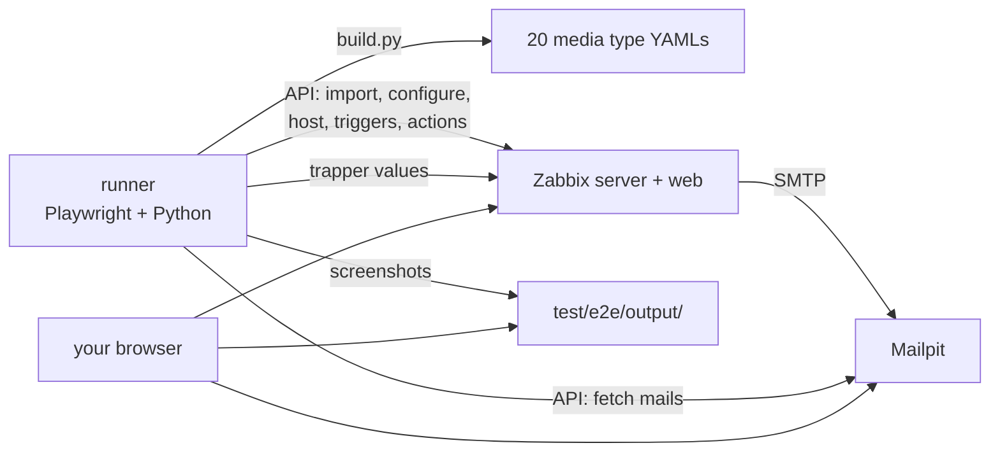

# Testing

Two levels:

| | What | Needs |
|---|---|---|
| **Previews** | the build renders every variant with sample data | Python, or Docker |
| **End-to-end** | a real Zabbix imports all variants, fires real events and sends real mails to a local mail catcher (Mailpit); every mail is checked, optionally screenshotted | Docker |

## Previews

```bash
python build.py --preview          # then open dist/previews/index.html
test/e2e/e2e.sh previews           # same in Docker, plus PNG screenshots: test/e2e/output/index.html
```

## End-to-end test



### Run it

Requirements: Docker with Compose v2, ~4 GB RAM for Docker, free ports 8080, 8025 and 8081.

```bash
test/e2e/e2e.sh run
```

The first run pulls the images (a few GB) and Zabbix initialises its database, which takes a few minutes. Afterwards `test/e2e/e2e.sh open` opens the result gallery and Mailpit in your browser. The results stay in `test/e2e/output/` (not committed) until the next run:

| | |
|---|---|
| `test/e2e/output/index.html` | every mail, grouped by variant and language, with links to the raw HTML - plus desktop, mobile and dark screenshots if you set `E2E_SCREENSHOTS` (see below) |
| `test/e2e/output/summary.txt` | mails received per media type, with anything missing |
| http://localhost:8025 | **Mailpit** - browse the mails like in a mail client, including its HTML and link checks |
| http://localhost:8080 | **Zabbix** (Admin / zabbix) - the imported media types, the test host, problems and actions |

The stack keeps running, so you can look around, change something and run again - `e2e.sh run` reuses it and replaces the test objects. When done:

```bash
test/e2e/e2e.sh down        # stops everything and deletes the database
```

### What the scenario does

1. Builds all media types from the working tree (`build.py` inside the runner).
2. Creates service *E2E online shop* (problem tag `e2e-service: shop`).
3. Imports the media types via the Zabbix API and points their SMTP at Mailpit.
4. Sets the global macros, gives user *Admin* one media per media type (recipient `<variant>.<lang>@e2e.test`), and creates user *e2e-operator* - Zabbix does not notify users about their own problem updates, so the acknowledgement below is made by this second user.
5. Creates host group *E2E*, host *e2e-host* with one trapper item and trigger per severity (the High one carries the service tag), a calculated item that divides by zero (for internal events), and three actions (trigger, internal, service) that notify *Admin* on problem, recovery and update.
6. Fires events and waits for the mails after each step:
   - five triggers go to PROBLEM (all but High), the broken item becomes unsupported,
   - once the service manager has loaded the service (see below), the High trigger goes to PROBLEM and takes the service with it,
   - *e2e-operator* acknowledges the High problem with a message and raises its severity to Disaster - a trigger update, and a service update because the service status follows,
   - everything recovers.
7. Downloads every mail from Mailpit, checks it and - if `E2E_SCREENSHOTS` is set - screenshots it with Chromium.

Zabbix creates a service event only when a service it already knows changes status, and the server loads new services every `ServiceManagerSyncFrequency` seconds (default 60). The runner therefore waits until 70 seconds after creating the service before firing the High problem - most of that time passes anyway while the first mails are delivered.

Expected per media type: 6 trigger problems, 1 trigger update, 6 trigger recoveries, 1 service problem, 1 service update, 1 service recovery, 1 internal problem, 1 internal recovery - 18 mails, 360 for all 20 media types.

Every mail (subject and body) is also checked for macros Zabbix left unresolved, such as `{SERVICE.STATUS}` or `*UNKNOWN*` - that means a template uses a macro the event source or Zabbix version does not support. The runner exits non-zero if mails are missing or contain unresolved macros; `summary.txt` says which.

Discovery and autoregistration messages are not triggered (they need network discovery or an agent); check them in the previews.

### Options

Environment variables for `e2e.sh`:

| Variable | Default | |
|---|---|---|
| `ZABBIX_TAG` | `alpine-7.0.30` | Zabbix image tag, e.g. `alpine-7.4.14`, `alpine-7.4-latest`, `alpine-trunk` (next major) |
| `E2E_VARIANTS` | all | comma list of variant ids from `build.yaml`, e.g. `compact,compact-nologo` |
| `E2E_LANGS` | all | comma list, e.g. `en,de` |
| `E2E_SCREENSHOTS` | `none` | `desktop`, `mobile`, `dark` or a comma list of them - adds a screenshot gallery (about a minute for all 360 mails and three modes) |
| `E2E_TIMEOUT` | `180` | seconds to wait for each batch of mails |
| `E2E_SERVICE_SYNC_WAIT` | `70` | seconds between creating the test service and firing its problem; must exceed the server's `ServiceManagerSyncFrequency` |
| `ZBX_WEB_PORT`, `MAILPIT_PORT`, `ASSETS_PORT` | `8080`, `8025`, `8081` | host ports |

```bash
E2E_VARIANTS=compact E2E_LANGS=de test/e2e/e2e.sh run      # quick: 18 mails
E2E_SCREENSHOTS=desktop,mobile,dark test/e2e/e2e.sh run    # with screenshot gallery
ZABBIX_TAG=alpine-7.4.14 test/e2e/e2e.sh run               # another Zabbix version
```

Switching `ZABBIX_TAG` on an existing stack needs `test/e2e/e2e.sh down` first - the database belongs to one Zabbix version.

### README screenshots

The images in `docs/img/` (used by the README) are real mails from this test, not mock-ups. Regenerate them whenever the look changes:

```bash
test/e2e/e2e.sh docs
git add docs/img && git commit -m "Update screenshots"
```

This runs the scenario for *standard* and *compact* in English with desktop, mobile and dark screenshots against the default Zabbix version, then composes

| File | Shows |
|---|---|
| `standard-vs-compact.png` | the same High problem in both flavours |
| `severities.png` | the six severities (compact) |
| `mobile-dark.png` | compact on a phone, standard in dark mode |
| `message-types.png` | update, recovery, service problem, internal problem (compact) |

The composition is `docs_images()` in `test/e2e/runner/run.py`.

### Other commands

```bash
test/e2e/e2e.sh up              # only start Zabbix + Mailpit, e.g. to import by hand
test/e2e/e2e.sh logs zabbix-server
```

### In CI

`.github/workflows/e2e.yml` runs the test on every pull request that touches the sources, against Zabbix 7.0, 7.4 and `alpine-trunk` (the next major version; allowed to fail as an early warning). The mails and screenshots of each run are attached as the `e2e-output-<tag>` artifact.

### Limits

Screenshots come from Chromium, i.e. they show what Apple Mail, Gmail, new Outlook, Outlook on the web or Thunderbird show. Classic Outlook for Windows (Word rendering engine) cannot run in Docker - check it in a real Outlook or with a rendering service such as Litmus or Email on Acid. The raw HTML of every mail is in `test/e2e/output/mails/` for that.

### Troubleshooting

| Problem | Solution |
|---|---|
| `timed out waiting for Zabbix API` | First start is slow; run again. `test/e2e/e2e.sh logs zabbix-server` shows the database initialisation. |
| `port is already allocated` | Set `ZBX_WEB_PORT` / `MAILPIT_PORT` / `ASSETS_PORT`. |
| Mails missing in `summary.txt` | `test/e2e/e2e.sh logs zabbix-server`; in the Zabbix UI check *Reports → Action log*. |
| Database errors after changing `ZABBIX_TAG` | `test/e2e/e2e.sh down`, then run again. |
